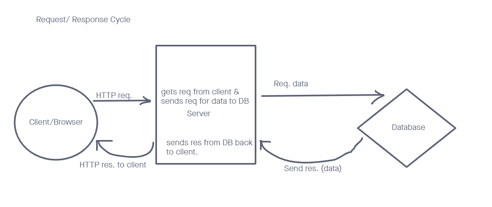
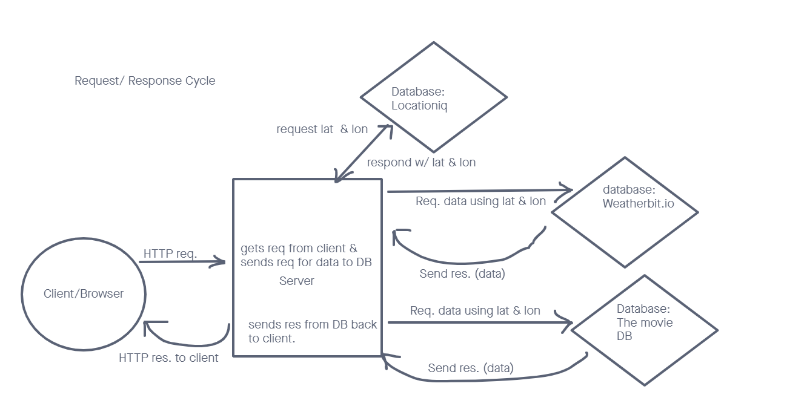

# City Explorer

**Author**: Scott Lease

**Version**: 1.0.0 (increment the patch/fix version number if you make more commits past your first submission)

## Overview

App that lets you select a city and you'll be provided with a map for that city as well as other info like restaurants and the weather.

## Getting started

## Architecture

Repo on GitHub. Uses HTML, CSS, JavaScript, React-bootstrap, Axios

## Change Log

Use this area to document the iterative changes made to your application as each feature is successfully implemented.

<!-- Use time stamps. Here's an example: 01-01-2001 4:59pm - Application now has a fully-functional express server, with a GET route for the location resource. -->

## Credit and Collaborators

Kirk Garrison helped to get maps to display properly and render.

## Time Estimates

###### Name of feature: Import and display maps for selected city

Estimate of time needed to complete: 5 hrs

Start time: 3:45

Finish time: 3:00

Actual time needed to complete: 8 hrs

###### Name of feature: Import and display weather for selected city

Estimate of time needed to complete: 3 hrs

Start time: 4:00

Finish time: 6:30

Actual time needed to complete: 2.5 hrs

###### Name of feature: Import and display movies named for selected city

Estimate of time needed to complete: 2 hrs

Start time: 1:30

Finish time: 4:00

Actual time needed to complete: 2.5 hrs

###### Name of feature: Make functions modular as possible

Estimate of time needed to complete: 3 hrs

Start time: TBD

Finish time: TBD

Actual time needed to complete: -- hrs

# Getting Started with Create React App

This project was bootstrapped with [Create React App](https://github.com/facebook/create-react-app).

## Available Scripts

In the project directory, you can run:

### `npm start`

Runs the app in the development mode.\
Open [http://localhost:3000](http://localhost:3000) to view it in the browser.

The page will reload if you make edits.\
You will also see any lint errors in the console.

### `npm test`

Launches the test runner in the interactive watch mode.\
See the section about [running tests](https://facebook.github.io/create-react-app/docs/running-tests) for more information.

### `npm run build`

Builds the app for production to the `build` folder.\
It correctly bundles React in production mode and optimizes the build for the best performance.

The build is minified and the filenames include the hashes.\
Your app is ready to be deployed!

See the section about [deployment](https://facebook.github.io/create-react-app/docs/deployment) for more information.

### `npm run eject`

**Note: this is a one-way operation. Once you `eject`, you can’t go back!**

If you aren’t satisfied with the build tool and configuration choices, you can `eject` at any time. This command will remove the single build dependency from your project.

Instead, it will copy all the configuration files and the transitive dependencies (webpack, Babel, ESLint, etc) right into your project so you have full control over them. All of the commands except `eject` will still work, but they will point to the copied scripts so you can tweak them. At this point you’re on your own.

You don’t have to ever use `eject`. The curated feature set is suitable for small and middle deployments, and you shouldn’t feel obligated to use this feature. However we understand that this tool wouldn’t be useful if you couldn’t customize it when you are ready for it.

## Learn More

You can learn more in the [Create React App documentation](https://facebook.github.io/create-react-app/docs/getting-started).

To learn React, check out the [React documentation](https://reactjs.org/).

### Code Splitting

This section has moved here: [https://facebook.github.io/create-react-app/docs/code-splitting](https://facebook.github.io/create-react-app/docs/code-splitting)

### Analyzing the Bundle Size

This section has moved here: [https://facebook.github.io/create-react-app/docs/analyzing-the-bundle-size](https://facebook.github.io/create-react-app/docs/analyzing-the-bundle-size)

### Making a Progressive Web App

This section has moved here: [https://facebook.github.io/create-react-app/docs/making-a-progressive-web-app](https://facebook.github.io/create-react-app/docs/making-a-progressive-web-app)

### Advanced Configuration

This section has moved here: [https://facebook.github.io/create-react-app/docs/advanced-configuration](https://facebook.github.io/create-react-app/docs/advanced-configuration)

### Deployment

This section has moved here: [https://facebook.github.io/create-react-app/docs/deployment](https://facebook.github.io/create-react-app/docs/deployment)

### `npm run build` fails to minify

This section has moved here: [https://facebook.github.io/create-react-app/docs/troubleshooting#npm-run-build-fails-to-minify](https://facebook.github.io/create-react-app/docs/troubleshooting#npm-run-build-fails-to-minify)
